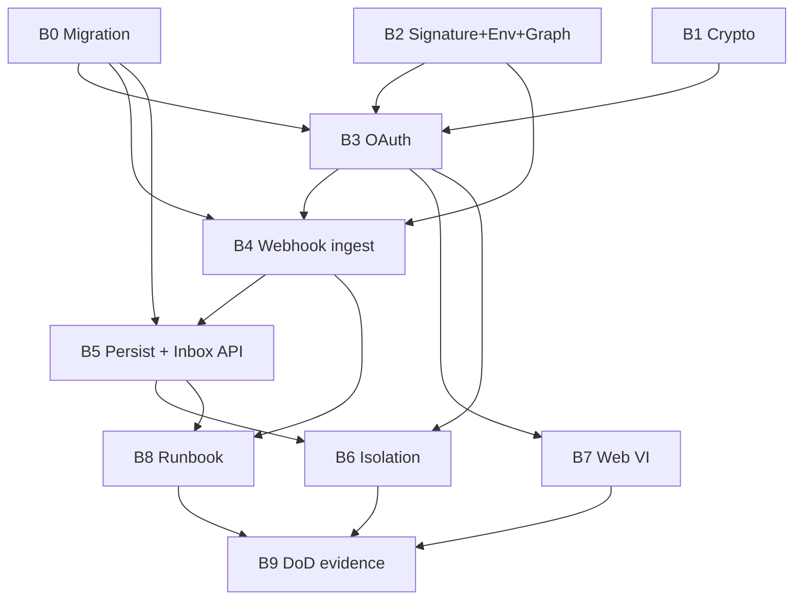

# Plan B — Kế hoạch thực thi theo thứ tự ưu tiên (hoàn thiện Wave D)

**Status:** READY TO EXECUTE  
**Authority (chi tiết code):** [plan-b-meta-channels](./2026-07-24-plan-b-meta-channels.md)  
**Roadmap tổng:** [priority-execution-roadmap](./2026-07-24-priority-execution-roadmap.md)  
**Baseline:** Plan A DONE trên `main` (`397601f`+)

---

## 1. Plan B nằm đâu trên đường hoàn thiện?

```
DONE     Plan A  Platform
▶ NOW    Plan B  Meta (Wave D)     ← tài liệu này
NEXT     Plan C  Catalog + AI
THEN     Plan D  Orders + Web + Hardening  → Pilot Phase 1
THEN     Plan E  M3 commercial ops
THEN     F→H     Phase 2–4                 → CPC
THEN     Plan I  M4                        → E100
```

**Hoàn thiện Plan B** = đóng Wave D DoD (OAuth Page+IG, token AES-GCM, webhook→inbox DB, isolation, VI connect tối thiểu, runbook).  
**Không** = Pilot / CPC / E100. Sau B chỉ được mở Plan C.

---

## 2. Mục tiêu hoàn thiện Plan B (một câu)

Shop gắn Facebook Page + Instagram; tin Meta vào DB qua webhook idempotent; token không plaintext / không lộ client; **không gọi LLM**.

---

## 3. Điều kiện bắt đầu (gate vào)

Chỉ mở branch Plan B khi **tất cả** đúng:

| # | Điều kiện | Kiểm |
|---|-----------|------|
| 1 | `main` đã có Plan A (health, JWT/Org, outbox+Inngest, RLS identity) | `git log -1 --oneline` trên `main` |
| 2 | Env nền: `TOKEN_ENCRYPTION_KEY`, Supabase, Inngest stub | `.env` / `.env.example` Plan A |
| 3 | Không mở song song Plan C/D trên critical path | một plan mở |
| 4 | Branch mới từ `main` sạch | `feat/plan-b-meta-channels` (worktree khuyến nghị) |

**Chuẩn bị Meta (có thể song song docs, không chặn B0–B2):**

- Meta App (dev): App ID, App Secret, Verify Token  
- Redirect URI khớp `META_REDIRECT_URI`  
- Quyền Phase 1 dự kiến: `pages_show_list`, `pages_messaging`, `instagram_basic`, `instagram_manage_messages`, `pages_read_engagement`  
- Live Page DM E2E: **amber OK** nếu chưa có App — vẫn đóng B với evidence ghi rõ

---

## 4. Thứ tự ưu tiên bắt buộc (B0 → B9)

Không đảo thứ tự cột “Phải xong trước”. Chỉ làm song song trong cùng **giai đoạn** khi ghi “Song song OK”.

### Sơ đồ phụ thuộc



### Bảng ưu tiên thực thi

| Ưu tiên | Giai đoạn | Task plan | Việc chính | Phải xong trước | Song song OK | Gate ra (xanh mới qua) |
|--------:|-----------|-----------|------------|-----------------|--------------|-------------------------|
| **B0** | Nền DB | Task 1 | Migration `channel_connections`, contacts, conversations, messages, `webhook_receipts` + RLS | — | — | SQL peer-check / migrate OK |
| **B1** | Nền bảo mật | Task 2 | AES-256-GCM (`SHA-256` derive key) + unit tests | — | **với B0** | crypto tests PASS |
| **B2** | Nền Meta | Task 3 | Signature HMAC, env `META_*`, Graph client tối thiểu | — | **với B0/B1** | signature tests PASS; env schema có META |
| **B3** | Kết nối kênh | Task 4 | OAuth URL + complete + list/revoke; encrypt token; audit | B0, B1, B2 | — | token không plaintext trong DB insert mock; API response không có token |
| **B4** | Critical path | Task 5 | GET verify + POST webhook; skip JWT/Org; receipt → outbox `meta.inbound` → **200**; **no LLM** | B0, B2, B3* | — | dedupe receipt; bad sig → 401; guards skip path |
| **B5** | Tin vào DB | Task 6 | Inngest `meta/persist_inbound`; map outbox→event; inbox read + takeover (`bot_epoch++`) | B4 | — | message persist từ fixture; takeover tăng epoch |
| **B6** | An toàn tenant | Task 7 | Isolation channels/inbox | B3, B5 | — | `pnpm test:isolation` PASS (cases channels/inbox) |
| **B7** | UX tối thiểu | Task 8 | Web VI “Kết nối kênh” | B3 | **sau B3**, có thể **song song B5–B6** nếu API list/oauth ổn định | typecheck web; không `NEXT_PUBLIC_` secret Meta |
| **B8** | Vận hành | Task 9 | README tunnel + `meta-down` runbook + `.env.example` | B4 (nên sau B5) | **song song B7** | docs đủ reproduce local webhook |
| **B9** | Đóng plan | Task 10 | `plan-b-dod-evidence.md` + đánh dấu roadmap | B6, B7, B8 | — | DoD bảng xanh/amber; merge `main` |

\*B3 trước B4 vì cần `channel_connections` active để map `page_id` → `org_id`. Có thể stub một connection trong test trước khi OAuth UI xong — **code path OAuth vẫn phải ship trước hoặc cùng PR với webhook map**.

---

## 5. Kế hoạch từng bước (checklist thực thi)

Chi tiết file/code: mở [plan-b-meta-channels](./2026-07-24-plan-b-meta-channels.md) đúng Task. Dưới đây là **thứ tự làm việc ngày-ngày**.

### Giai đoạn 1 — Nền (B0 → B2) — làm trước mọi HTTP Meta

**Mục tiêu giai:** schema + crypto + verify signature sẵn; chưa cần Meta App thật.

1. **B0** — Viết migration inbox/channels/receipts  
   - UNIQUE org+provider+page; UNIQUE receipt; partial unique `provider_message_id`  
   - RLS: member SELECT; writes service role  
   - Commit: `feat(db): meta channel connections and inbox tables`

2. **B1** (song song B0 nếu 2 người) — `token-crypto` + tests roundtrip/tamper  
   - Commit: `feat(api): aes-256-gcm meta token crypto`

3. **B2** — `verifyMetaSignature` + `META_*` env + Graph client stub  
   - Commit: `feat(api): meta signature verify graph client and env`

**Cổng G1:** crypto + signature tests xanh; migration merged trên branch.

---

### Giai đoạn 2 — Kết nối (B3)

**Mục tiêu giai đoạn:** org có thể gắn Page/IG; token chỉ dạng `access_token_enc`.

4. **B3** — Channels module  
   - `GET /v1/channels/meta/oauth-url`  
   - `POST /v1/channels/meta/complete`  
   - `GET /v1/channels`, `POST /v1/channels/:id/revoke`  
   - Permission: mutate = `channels.connect`; list = membership  
   - Commit: `feat(api): meta oauth channel connect with encrypted tokens`

**Cổng G2:** unit test “encrypt + omit secrets”; không lộ token trong JSON response.

---

### Giai đoạn 3 — Critical path Meta → 200 (B4)

**Mục tiêu giai đoạn:** Meta gọi webhook không bị JWT chặn; không double-outbox; không gọi AI.

5. **B4** — Webhook controller/service + raw body + guard skip `/v1/webhooks/meta`  
   - GET challenge  
   - POST: sig → receipt → `enqueueOutbox(..., eventName: 'meta.inbound')` → 200  
   - Commit: `feat(api): meta webhook verify receipt and outbox enqueue`

**Cổng G3:** 4 unit cases (challenge, bad sig, enqueue once, skip duplicate) PASS.

---

### Giai đoạn 4 — Persist + đọc inbox (B5)

**Mục tiêu giai đoạn:** tin nằm trong DB; human takeover chặn bot epoch sau này (Plan C).

6. **B5**  
   - Wire publisher: `meta.inbound` → Inngest `meta/persist_inbound`  
   - Job upsert contact/conversation/message (idempotent `provider_message_id`)  
   - APIs: list conversations, messages, takeover  
   - Fixture `tests/fixtures/meta/messenger-inbound.json`  
   - Commit: `feat(api): persist meta inbound messages and inbox read apis`

**Cổng G4:** persist từ fixture; takeover `bot_epoch++`; **zero** import/call sang `apps/ai`.

---

### Giai đoạn 5 — An toàn + UX + vận hành (B6 → B8)

7. **B6** — Isolation cross-tenant channels + inbox → `pnpm test:isolation`  
8. **B7** — Trang VI settings/channels + link dashboard (sau B3; ưu tiên sau G2)  
9. **B8** — Tunnel README + `docs/runbooks/meta-down.md`

**Cổng G5:** isolation xanh; web typecheck; runbook có bước triage receipts → outbox → Inngest.

---

### Giai đoạn 6 — Đóng Plan B (B9)

10. **B9** — Chạy cổng tự động + ghi `plan-b-dod-evidence.md`  
    - Live Meta E2E: PASS hoặc **NOT RUN (amber)** có lý do  
    - Cập nhật [priority-execution-roadmap](./2026-07-24-priority-execution-roadmap.md): Plan B = DONE  
    - Merge FF vào `main` + push khi DoD chấp nhận  
    - Commit: `docs: record plan B DoD evidence`

**Cổng G6 (Plan B hoàn thiện):** bảng DoD bên dưới không còn ô đỏ bắt buộc.

---

## 6. Definition of Done — Plan B hoàn thiện

| # | Tiêu chí | Bắt buộc? |
|---|----------|-----------|
| 1 | Migration + RLS inbox/channels/receipts | Có |
| 2 | Crypto AES-256-GCM tests xanh | Có |
| 3 | OAuth lưu `access_token_enc`; list API không lộ token | Có |
| 4 | Webhook signature; duplicate receipt → 200 không double-outbox | Có |
| 5 | JwtAuthGuard/OrgGuard skip `/v1/webhooks/meta` | Có |
| 6 | Job persist ghi message; không gọi LLM | Có |
| 7 | Takeover `bot_paused` + `bot_epoch++` | Có |
| 8 | Isolation channels/inbox xanh | Có |
| 9 | Web VI “Kết nối kênh” | Có |
| 10 | Runbook meta-down + README tunnel | Có |
| 11 | `plan-b-dod-evidence.md` | Có |
| 12 | Live Page/IG DM E2E | Amber OK nếu chưa Meta App |

---

## 7. Cấm trong Plan B (để không phá ưu tiên hoàn thiện)

| Cấm | Để plan |
|-----|---------|
| Gọi LLM / RAG / `ai_runs` từ webhook hoặc persist | **C** |
| Orders, stock, export fulfillment | **D** |
| Inbox UI poll đầy đủ / App Review package | **D** |
| Carrier / payment / Phase 2 channels | F+ |
| Claim Pilot / CPC / 100/100 sau chỉ Plan B | — |

---

## 8. Cách chạy (chọn một)

| Cách | Khi nào |
|------|---------|
| **Subagent-Driven** (khuyến nghị) | Từng B0→B9, review giữa task; worktree `feat/plan-b-meta-channels` |
| **Inline** | Một session tuần tự theo bảng §4 |

Luật: **một task ưu tiên xong + commit** trước khi mở task phụ thuộc; không nhảy B4 trước G1; không merge `main` trước G6.

---

## 9. Sau khi Plan B xanh

1. Tag/ghi evidence; cập nhật roadmap Plan B DONE.  
2. Mở ngay [Plan C](./2026-07-24-plan-c-catalog-ai.md) (Catalog + AI) — P1.  
3. Không start Plan D cho đến Plan C DoD.

---

## 10. Tóm tắt một trang (in ra khi execute)

```
B0 Migration
B1 Crypto          } Giai đoạn 1 — song song OK
B2 Signature/Env
        ↓
B3 OAuth           } Giai đoạn 2
        ↓
B4 Webhook→200     } Giai đoạn 3 — CRITICAL
        ↓
B5 Persist+Inbox   } Giai đoạn 4
        ↓
B6 Isolation
B7 Web VI          } Giai đoạn 5 — B7/B8 song song sau B3/B4
B8 Runbook
        ↓
B9 DoD + merge     } Plan B HOÀN THIỆN → Plan C
```
