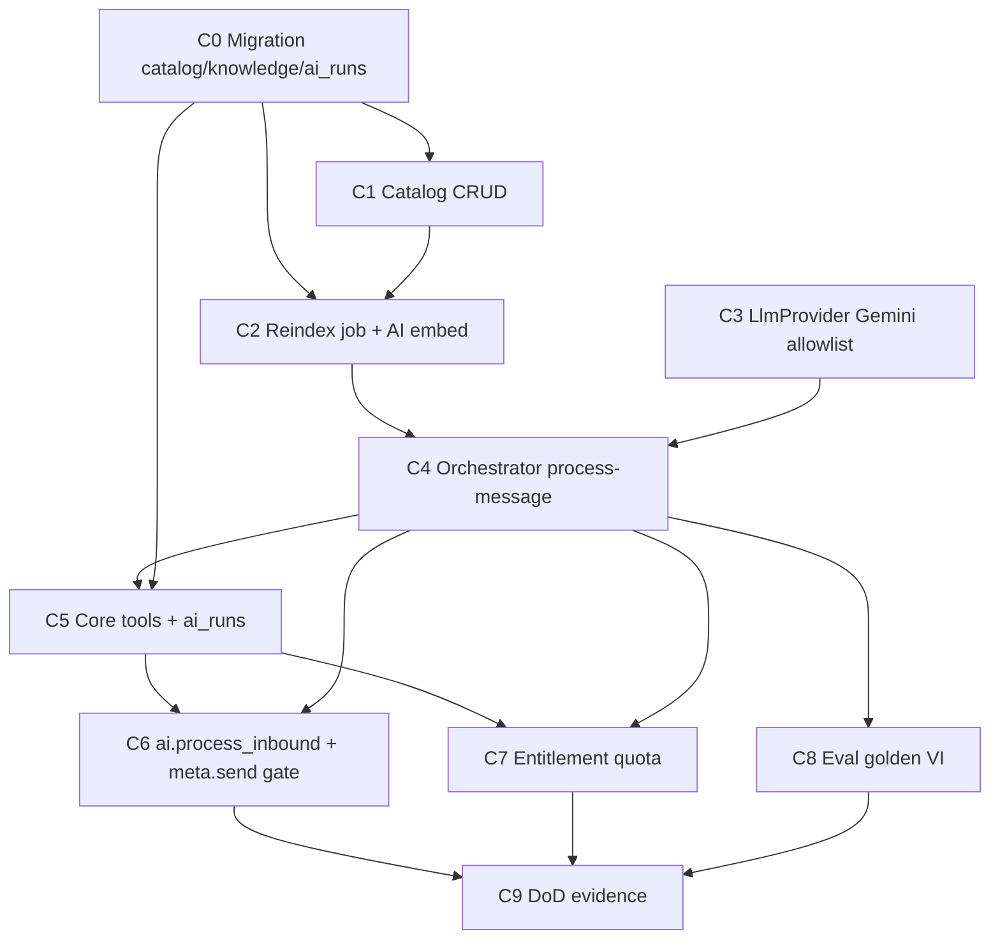

# Plan C — Kế hoạch thực thi theo thứ tự ưu tiên (Catalog + AI → tiến tới hoàn thiện)

**Status:** READY TO EXECUTE  
**Authority (chi tiết task):** [plan-c-catalog-ai](./2026-07-24-plan-c-catalog-ai.md)  
**Roadmap tổng:** [priority-execution-roadmap](./2026-07-24-priority-execution-roadmap.md)  
**Baseline:** Plan B DONE trên `main` (`2176559`+)

---

## 1. Plan C nằm đâu trên đường hoàn thiện?

```
DONE     Plan A  Platform
DONE     Plan B  Meta channels
▶ NOW    Plan C  Catalog + AI (Waves E+F)   ← tài liệu này
NEXT     Plan D  Orders + Web + Hardening  → Pilot Phase 1
THEN     Plan E  M3 commercial ops
THEN     F→H     Phase 2–4                 → CPC
THEN     Plan I  M4                        → E100
```

| Đích | Ký hiệu | Điều kiện |
|------|---------|-----------|
| Đóng Wave E+F | **Plan C DoD** | Catalog + RAG + tools + eval + evidence |
| Pilot Phase 1 | Sau **Plan D** | Orders + Web VI + legal/App Review |
| CPC | Sau Plan E + F–H | Sản phẩm thương mại hoàn thiện |
| E100 | + Plan I (M4) | Enterprise 100/100 chính thức |

**Hoàn thiện Plan C** ≠ Pilot / CPC / E100. Sau C chỉ mở **Plan D**.

---

## 2. Mục tiêu hoàn thiện Plan C (một câu)

Shop CRUD catalog → knowledge reindex org-scoped → tin inbound chạy AI RAG grounded (hoặc escalate) → draft order chỉ qua Core tools → Core ghi `ai_runs`; kill switch + `bot_epoch` chặn gửi sai.

---

## 3. Điều kiện bắt đầu (gate vào)

| # | Điều kiện | Kiểm |
|---|-----------|------|
| 1 | Plan B trên `main` (webhook, persist, inbox, takeover `bot_epoch`) | `git log -1` ≥ `2176559` |
| 2 | Outbox + Inngest trong `apps/api`; m2m `X-Service-Key` AI health | Plan A+B |
| 3 | Env sẵn: `TOKEN_ENCRYPTION_KEY`, Supabase, Inngest; thêm `GEMINI_API_KEY` khi tới C3–C4 | `.env.example` |
| 4 | Một plan mở — **không** song song Plan D critical path | — |
| 5 | Branch mới từ `main`: `feat/plan-c-catalog-ai` (worktree khuyến nghị) | — |

**Chuẩn bị Gemini (không chặn C0–C1):** API key Free; model allowlist ghi trong env/`AI_MODEL_ALLOWLIST`; embedding dim **768** (ADR khi Task 1).

---

## 4. Thứ tự ưu tiên bắt buộc trong Plan C (C0 → C9)

Không đảo cột “Phải xong trước”. Song song chỉ trong cùng giai đoạn khi ghi rõ.

### Sơ đồ phụ thuộc



### Bảng ưu tiên

| Ưu tiên | Giai đoạn | Task plan | Việc chính | Phải xong trước | Song song OK | Gate ra |
|--------:|-----------|-----------|------------|-----------------|--------------|---------|
| **C0** | Nền DB | Task 1 | Migration `products`, `product_variants`, `knowledge_chunks` (vector 768), `ai_runs` + RLS + ADR dims | — | — | migrate/SQL peer-check; ADR `0003-embedding-dims.md` |
| **C1** | Catalog | Task 2 | CRUD `/v1/catalog/products`; bigint VND; outbox `knowledge.reindex` | C0 | — | TDD create; permissions `catalog.read`/`write` |
| **C2** | Knowledge | Task 3 | Inngest reindex → AI embed → Core ingest chunks | C0, C1 | **với C3** sau khi ingest contract ổn | chunk org-scoped; no broad AI service-role write |
| **C3** | LLM infra | Task 4 | `LlmProvider` + Gemini + allowlist | — | **với C1–C2** | reject model ngoài allowlist |
| **C4** | RAG loop | Task 5 | Orchestrator `process-message`; escalate nếu thiếu evidence | C2, C3 | — | pytest mocked; structured response |
| **C5** | Core tools | Task 6 | `get-product`, `create-draft-order`; Core ghi `ai_runs`; draft max | C0, C4* | — | mutations Core-only; `prompt_version` + model trên run |
| **C6** | Critical path | Task 7 | Inngest `ai.process_inbound` + `meta.send` gated bởi kill/`bot_paused`/`bot_epoch` | C5 | — | epoch mismatch / kill → không gửi |
| **C7** | Quota | Task 8 | Check entitlement tokens trước LLM | C4 hoặc C5 | **sau C4**, có thể **song song C6** nếu hook sẵn | 429/escalate khi vượt |
| **C8** | Eval | Task 9 | Golden VI ≥5 + adversarial ≥10 CI | C4 | **song song C6–C7** | runner xanh |
| **C9** | Đóng | Task 10 | `plan-c-dod-evidence.md` + roadmap Plan C DONE | C6, C7, C8 | — | DoD bảng xanh/amber; merge `main` |

\*C5 có thể stub orchestrator response trong unit test trước C4 xanh hoàn toàn — **không** merge C5 mà thiếu contract process-message.

**Cấm nhảy:** C4 trước C2+C3; C6 trước C5; C9 trước C6–C8; **không** gọi LLM trong webhook HTTP (giữ Plan B).

---

## 5. Kế hoạch từng bước (checklist thực thi)

Chi tiết file/code: [plan-c-catalog-ai](./2026-07-24-plan-c-catalog-ai.md). Dưới đây là thứ tự ngày-ngày.

### Giai đoạn 1 — Nền dữ liệu + catalog (C0 → C1)

1. **C0** — Migration + enable `vector`; RLS harden; ADR embedding 768  
2. **C1** — Catalog module; enqueue `knowledge.reindex` trên write  

**Cổng G1:** CRUD + RLS; outbox event đúng tên.

### Giai đoạn 2 — Pipeline kiến thức + LLM (C2 → C3)

3. **C2** — Job reindex + AI embed + Core `POST /internal/v1/knowledge/chunks`  
4. **C3** (song song được) — Gemini `LlmProvider` + allowlist  

**Cổng G2:** reindex cập nhật chunk theo `org_id`; model lạ bị reject.

### Giai đoạn 3 — Orchestrator grounded (C4)

5. **C4** — Retrieve top-k → complete → `{ replyText, citations, toolsUsed, promptVersion, model, tokens, escalate }`  

**Cổng G3:** empty evidence → escalate; pytest xanh.

### Giai đoạn 4 — Tools + vòng inbound thật (C5 → C6)

6. **C5** — Internal tools + `ai_runs` writer; draft max VND  
7. **C6** — Chain persist (B) → process AI → conditional `meta.send`  

**Cổng G4:** zero LLM trong webhook; kill/`bot_epoch` tests; Core owns `ai_runs`.

### Giai đoạn 5 — Quota + eval + đóng (C7 → C9)

8. **C7** — Entitlement token check trước LLM  
9. **C8** — Eval golden VI + adversarial  
10. **C9** — Evidence + đánh dấu roadmap → merge  

**Cổng G5:** Plan C DoD không còn ô đỏ bắt buộc.

---

## 6. Definition of Done — Plan C hoàn thiện

| # | Tiêu chí | Bắt buộc? |
|---|----------|-----------|
| 1 | products/variants CRUD + RLS | Có |
| 2 | reindex cập nhật `knowledge_chunks` org-scoped | Có |
| 3 | m2m process-message → grounded hoặc escalate | Có |
| 4 | Core ghi `ai_runs` (`prompt_version`, model allowlist) | Có |
| 5 | Tools getProduct + createDraftOrder (draft only) qua Core | Có |
| 6 | `bot_epoch` mismatch / kill → drop outbound | Có |
| 7 | Quota check trước LLM | Có |
| 8 | Eval golden VI + adversarial ≥10 xanh | Có |
| 9 | Isolation: không retrieve cross-org chunks | Có |
| 10 | `plan-c-dod-evidence.md` | Có |
| 11 | Live Gemini E2E end-to-end Page DM | Amber OK nếu chưa key/tunnel |

---

## 7. Cấm trong Plan C

| Cấm | Để plan |
|-----|---------|
| Full Web inbox/catalog UI polish | **D** |
| Orders confirm/export/stock lifecycle đầy đủ* | **D** |
| Meta App Review package, Terms/Privacy pages | **D** |
| Carrier / payment / Phase 2 | F+ |
| Claim Pilot / CPC / 100/100 chỉ sau Plan C | — |

\*Tool `createDraftOrder` tạo **draft** trong C; confirm/export là Plan D. Có thể cần bảng `orders` tối thiểu nếu chưa có — nếu thiếu schema, thêm migration nhỏ trong C5 (draft-only columns) hoặc pull Task 1 Plan D sớm **chỉ** phần draft table; ghi rõ trong evidence.

---

## 8. Sau Plan C — thứ tự ưu tiên tới hoàn thiện (không đảo)

```
P1  Plan C  Catalog+AI     ← ĐANG TỚI (playbook này)
P2  Plan D  Orders+Web+Hardening  → Pilot Phase 1
P3  Plan E  M3 (Pro, always-on, billing, DR)
P4a Plan F  Phase 2 Operations
P4b Plan G  Phase 3 Intelligence
P4c Plan H  Phase 4 ERP-lite      → CPC
P5  Plan I  M4                     → E100
```

Playbook Plan D (khi tới): mở rộng tương tự từ [plan-d-orders-web-hardening](./2026-07-24-plan-d-orders-web-hardening.md).

---

## 9. Cách chạy

| Cách | Khi nào |
|------|---------|
| **Subagent-Driven** (khuyến nghị) | Từng C0→C9, review giữa task; worktree `feat/plan-c-catalog-ai` |
| **Inline** | Một session tuần tự |

Luật: một ưu tiên xong + commit trước khi mở task phụ thuộc; không merge `main` trước G5.

---

## 10. Tóm tắt một trang

```
C0 Migration catalog/knowledge/ai_runs
C1 Catalog CRUD + reindex outbox     } Giai đoạn 1
        ↓
C2 Reindex → AI embed → Core ingest
C3 Gemini LlmProvider + allowlist    } Giai đoạn 2 — C2∥C3 OK
        ↓
C4 Orchestrator grounded             } Giai đoạn 3
        ↓
C5 Core tools + ai_runs
C6 process_inbound + meta.send gate  } Giai đoạn 4 — CRITICAL
        ↓
C7 Quota
C8 Eval golden VI                    } Giai đoạn 5 — C7∥C8 sau C4
C9 DoD + merge                       } Plan C HOÀN THIỆN → Plan D
```
