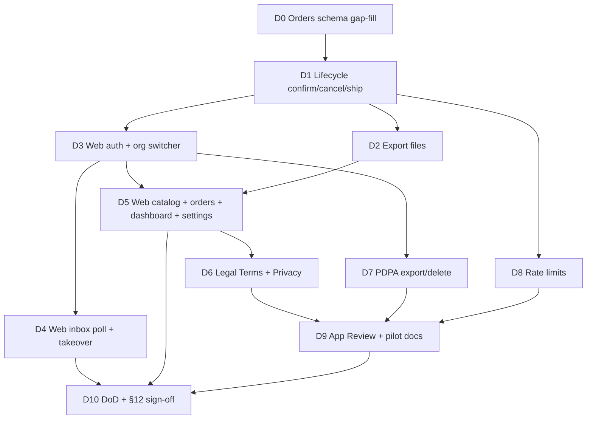

# Plan D — Kế hoạch thực thi theo thứ tự ưu tiên (Orders + Web + Hardening → Pilot)

**Status:** READY TO EXECUTE  
**Authority (chi tiết task):** [plan-d-orders-web-hardening](./2026-07-24-plan-d-orders-web-hardening.md)  
**Roadmap tổng:** [priority-execution-roadmap](./2026-07-24-priority-execution-roadmap.md)  
**Baseline:** Plan C DONE trên `main` (`127624e`+)

---

## 1. Plan D nằm đâu trên đường hoàn thiện?

```
DONE     Plan A  Platform
DONE     Plan B  Meta channels
DONE     Plan C  Catalog + AI
▶ NOW    Plan D  Orders + Web VI + Hardening (G+H+I)  ← tài liệu này
              └─→ Pilot Phase 1
THEN     Plan E  M3 commercial ops
THEN     F→H     Phase 2–4                            → CPC
THEN     Plan I  M4                                   → E100
```

| Đích | Ký hiệu | Điều kiện |
|------|---------|-----------|
| Đóng Waves G+H+I | **Plan D DoD** | Orders lifecycle + Web VI đủ dùng + legal/PDPA/rate-limit/App Review |
| **Pilot Phase 1** | Sau Plan D | Design §12.1 + §12.2 sign-off trong evidence |
| CPC | Sau Plan E + F–H | Sản phẩm thương mại hoàn thiện |
| E100 | + Plan I (M4) | Enterprise 100/100 chính thức |

**Hoàn thiện Plan D** = Pilot Phase 1 sẵn sàng. **Không** = CPC / E100. Sau D → Plan E khi sắp có / có khách trả tiền; **không** nhảy Phase 2 trước Pilot DoD.

---

## 2. Mục tiêu hoàn thiện Plan D (một câu)

Shop confirm/cancel/ship đơn + trừ kho đúng; export file; Web VI đủ vận hành (inbox/catalog/orders/dashboard/channels); Terms/Privacy + PDPA path + rate limits + gói App Review — sẵn sàng pilot có kiểm soát.

---

## 3. Điều kiện bắt đầu (gate vào)

| # | Điều kiện | Kiểm |
|---|-----------|------|
| 1 | Plan C trên `main` (catalog, AI loop, draft tool, `ai_runs`) | `git log -1` ≥ `127624e` |
| 2 | Plan B channels/inbox/takeover API sẵn | — |
| 3 | **Lưu ý schema:** Plan C đã có migration draft `orders`/`order_items` cho AI tools — Task 1 = **gap-fill** (cột lifecycle, indexes, `idempotency_keys`) chứ không tạo lại từ đầu nếu đã đủ §8.7 |
| 4 | Một plan mở — không song song Plan E critical path / Phase 2 | — |
| 5 | Branch: `feat/plan-d-orders-web-hardening` (worktree khuyến nghị) | — |

---

## 4. Thứ tự ưu tiên bắt buộc trong Plan D (D0 → D10)

Không đảo cột “Phải xong trước”. Song song chỉ khi ghi rõ.

### Sơ đồ phụ thuộc



### Bảng ưu tiên

| Ưu tiên | Giai đoạn | Task plan | Việc chính | Phải xong trước | Song song OK | Gate ra |
|--------:|-----------|-----------|------------|-----------------|--------------|---------|
| **D0** | Nền DB | Task 1 | Gap-fill `orders`/`order_items` + RLS; thêm `idempotency_keys` nếu thiếu | — | — | Schema ≥ §8.7; soft peer-check |
| **D1** | Critical orders | Task 2 | draft→confirm→ship/cancel; stock on confirm; restore cancel; Idempotency-Key; audit; `auto_confirm` | D0 | — | TDD không oversell; bigint VND; E.164 |
| **D2** | Export | Task 3 | `GET /v1/orders/export` xlsx/csv/(pdf optional); `orders.export` | D1 | **với D3** | File mở được |
| **D3** | Web nền | Task 4 | Auth VI + org switcher + invites; `X-Org-Id` | — | **với D1–D2** sau API ổn | Không secret server trên web |
| **D4** | Web inbox | Task 5 | Poll 3–5s + thread + takeover | D3 | — | Takeover gọi API Plan B |
| **D5** | Web ops | Task 6 | Catalog + orders list/confirm/export + dashboard + settings (AI/auto_confirm) | D1, D2, D3 | **sau D3; ∥ D4** nếu team 2 | VI đủ dùng staging |
| **D6** | Legal | Task 7 | Terms + Privacy VI | — | **sau D3**, ∥ D4–D5 | Pages public |
| **D7** | PDPA | Task 8 | Org export + delete-request + runbook | D3 (auth) | **∥ D6/D8** | Endpoint + runbook |
| **D8** | Hardening | Task 9 | Rate limit auth/webhook/tools | — | **∥ D6–D7** | Tests hoặc smoke limit |
| **D9** | Go-live docs | Task 10 | Meta App Review checklist + staging/pilot docs | D6–D8 nên có | — | Checklist file |
| **D10** | Đóng Pilot | Task 11 | `plan-d-dod-evidence.md` + §12.1/§12.2 | D4, D5, D9 | — | Plan D DONE → Pilot |

**Cấm nhảy:** D1 trước D0; D5 orders UI trước D1; D10 trước D4+D5+D9; carrier/payment/Phase 2.

---

## 5. Kế hoạch từng bước (checklist thực thi)

Chi tiết file/code: [plan-d-orders-web-hardening](./2026-07-24-plan-d-orders-web-hardening.md).

### Giai đoạn 1 — Orders Core (D0 → D2) — Wave G

1. **D0** — Audit migration Plan C vs §8.7; bổ sung cột/status/indexes/`idempotency_keys`  
2. **D1** — Lifecycle APIs + stock race tests + audit  
3. **D2** — Export xlsx/csv (+ pdf optional)

**Cổng G1:** Confirm trừ kho; cancel restore; export mở được.

### Giai đoạn 2 — Web VI sản phẩm (D3 → D5) — Wave H

4. **D3** — Auth + org switcher + invites  
5. **D4** — Inbox poll + takeover (có thể ∥ phần D5)  
6. **D5** — Catalog + Orders + Dashboard + Settings (+ channels đã có từ Plan B)

**Cổng G2:** Design §12.1 product surfaces dùng được trên staging (manual OK trong evidence).

### Giai đoạn 3 — Hardening + go-live prep (D6 → D9) — Wave I

7. **D6** — Terms + Privacy VI  
8. **D7** — PDPA export/delete-request  
9. **D8** — Rate limits  
10. **D9** — App Review + pilot/runbook checklist  

**Cổng G3:** Legal + PDPA path + limits + Meta checklist có file.

### Giai đoạn 4 — Đóng Pilot (D10)

11. **D10** — Evidence + §12.1/§12.2 bảng sign-off; roadmap Plan D DONE  

**Cổng G4:** Pilot Phase 1 **READY** (amber live Meta/App Review submit OK nếu chưa submit Meta).

---

## 6. Definition of Done — Plan D / Pilot

| # | Tiêu chí | Bắt buộc? |
|---|----------|-----------|
| 1 | Orders states + confirm/cancel/ship + stock rules tested | Có |
| 2 | Export CSV/Excel (+ PDF optional) | Có (PDF amber OK) |
| 3 | Web: org switcher, inbox+takeover, catalog, orders, dashboard, channels, settings | Có |
| 4 | Terms + Privacy VI | Có |
| 5 | PDPA export + delete/anonymize path | Có |
| 6 | Rate limits auth/webhook/tools | Có |
| 7 | Meta App Review checklist doc | Có |
| 8 | Design §12 checklist trong `plan-d-dod-evidence.md` | Có |
| 9 | Live Meta App Review **submitted** | Amber OK nếu checklist đủ, chưa submit |
| 10 | M3 paid infra | Không — Plan E |

---

## 7. Cấm trong Plan D

| Cấm | Để plan |
|-----|---------|
| Supabase Pro / always-on / billing Stripe thật | **E** |
| GHN/GHTK / COD đối soát sâu | **F** |
| Ads / advisor AI / public API enterprise | **G** |
| ERP-lite / multi-warehouse | **H** |
| Claim CPC / E100 / 100/100 | — |

---

## 8. Sau Plan D — thứ tự ưu tiên tới hoàn thiện (không đảo)

```
P2  Plan D  ← ĐANG TỚI → Pilot Phase 1
P3  Plan E  M3 (Pro, always-on, billing, DR)   khi có / sắp có khách
P4a Plan F  Phase 2 Operations
P4b Plan G  Phase 3 Intelligence
P4c Plan H  Phase 4 ERP-lite                   → CPC
P5  Plan I  M4                                  → E100
```

---

## 9. Cách chạy

| Cách | Khi nào |
|------|---------|
| **Subagent-Driven** (khuyến nghị) | Từng D0→D10; worktree `feat/plan-d-orders-web-hardening` |
| **Inline** | Một session tuần tự |

Luật: một ưu tiên xong + commit trước task phụ thuộc; không merge `main` trước G4.

---

## 10. Tóm tắt một trang

```
D0 Orders schema gap-fill
D1 Lifecycle + stock + idempotency   } Giai đoạn 1 — Wave G
D2 Export
        ↓
D3 Auth + org switcher
D4 Inbox poll + takeover             } Giai đoạn 2 — Wave H
D5 Catalog + Orders + Dashboard      } D4 ∥ D5 sau D3
        ↓
D6 Legal VI
D7 PDPA
D8 Rate limits                       } Giai đoạn 3 — Wave I (∥ OK)
D9 App Review docs
        ↓
D10 DoD + §12 → PILOT PHASE 1        } Plan D HOÀN THIỆN → Plan E khi cần
```
