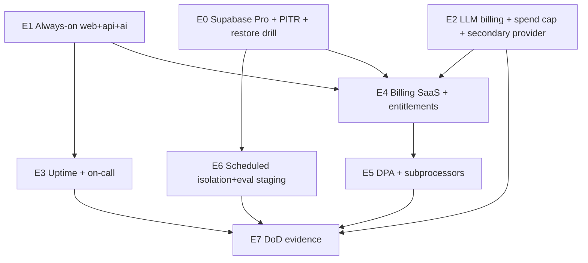

# Plan E — Kế hoạch thực thi theo thứ tự ưu tiên (M3 Commercial Ops → bán pilot an toàn)

**Status:** READY WHEN CUSTOMER IMMINENT (không đốt paid sớm nếu chưa cần)  
**Authority (outline):** [plan-e-m3-commercial-ops](./2026-07-24-plan-e-m3-commercial-ops.md)  
**Roadmap tổng:** [priority-execution-roadmap](./2026-07-24-priority-execution-roadmap.md)  
**Baseline:** Plan D DONE trên `main` (`af8413a`+) — **Pilot Phase 1 ready**

---

## 1. Plan E nằm đâu trên đường hoàn thiện?

```
DONE     Plan A–D  → Pilot Phase 1
▶ NEXT   Plan E    Gate M3 Commercial Ops   ← tài liệu này
THEN     Plan F    Phase 2 Operations
THEN     Plan G    Phase 3 Intelligence
THEN     Plan H    Phase 4 ERP-lite         → CPC
THEN     Plan I    M4                       → E100
```

| Đích | Ký hiệu | Điều kiện |
|------|---------|-----------|
| Pilot Phase 1 | Sau **Plan D** | **ĐÃ ĐẠT** (docs/evidence) |
| Bán pilot an toàn | Sau **Plan E / M3** | Pro DB, always-on, LLM cap, billing, DR |
| **CPC** | Sau Plan E + **F–H** | Bộ Phase 1–4 + M3 |
| **E100** | + Plan I (M4) | Enterprise 100/100 |

**Hoàn thiện Plan E** ≠ CPC / E100. Sau E mới mở Plan F (full plan viết just-in-time).

---

## 2. Mục tiêu hoàn thiện Plan E (một câu)

Critical path hết Free cold-start: Supabase Pro+PITR+restore drill, host always-on, LLM paid+cap, monitoring/on-call, billing/entitlements, DPA pack, isolation/eval định kỳ trên staging.

---

## 3. Khi nào **bật** Plan E (gate vào)

| # | Điều kiện | Ghi chú |
|---|-----------|---------|
| 1 | Plan D DoD xanh trên `main` | Đã có |
| 2 | **Khách / pilot trả tiền sắp hoặc đang onboard** — **hoặc** webhook staging miss vì sleep không chấp nhận được | Free-first đến lúc này |
| 3 | Budget paid (Supabase Pro + Render/Fly always-on + LLM) đã duyệt | Owner |
| 4 | Staging ≠ production luôn | Không đụng prod Free bằng tay bừa |

**Không** start E chỉ vì “muốn đẹp infra” khi chưa có khách — trừ staging always-on tạm cho Meta App Review.

---

## 4. Thứ tự ưu tiên bắt buộc trong Plan E (E0 → E7)

Plan E là **ops + config + ít code**. Nhiều task không phải feature Nest — vẫn commit evidence/docs/runbook.

### Sơ đồ phụ thuộc



### Bảng ưu tiên

| Ưu tiên | M3 | Task outline | Việc chính | Phải xong trước | Song song OK | Gate ra |
|--------:|----|--------------|------------|-----------------|--------------|---------|
| **E0** | M3.1 | Task 1 | Upgrade Supabase **Pro** prod; bật PITR; **chạy restore drill 1 lần**; ghi biên bản | — | — | Drill log + RPO/RTO note |
| **E1** | M3.2 | Task 2 | Render/Fly **always-on** web+api+ai (paid); bỏ sleep critical path | — | **∥ E0** | Webhook không miss vì cold start |
| **E2** | M3.3 | Task 3 | LLM billing + spend cap; secondary `LlmProvider` config/docs | — | **∥ E0–E1** | Cap chặn vượt; failover doc |
| **E3** | M3.4 | Task 4 | UptimeRobot/Better Stack; on-call rotation doc | E1 | — | Alert webhook/api/ai down |
| **E4** | M3.5 | Task 5 | Stripe **hoặc** PayOS **hoặc** invoice+plan flags; enforce entitlements | E0, E2 (nên) | — | Shop vượt quota bị gate |
| **E5** | M3.6 | Task 6 | DPA template + subprocessors list nội bộ | — | **∥ E3–E4** | File sẵn ký pilot |
| **E6** | M3.7 | Task 7 | Isolation + eval **định kỳ** trên staging (CI cron) | E0 (staging ổn) | **∥ E4–E5** | Schedule xanh |
| **E7** | — | Task 8 | `plan-e-dod-evidence.md` + roadmap Plan E DONE | E0–E6 | — | M3 đóng |

**Cấm nhảy:** E4 billing charge trước khi E0 backup/PITR sẵn; E7 trước restore drill; claim CPC/E100 sau chỉ Plan E.

---

## 5. Kế hoạch từng bước (checklist)

Chi tiết mở rộng task khi activate — dưới đây là thứ tự làm việc.

### Giai đoạn 1 — Nền vận hành (E0 → E1)

1. **E0** — Supabase Pro + PITR + restore drill (staging trước hoặc prod theo policy; **ít nhất 1 drill thật**)  
2. **E1** — Always-on hosts; health cron chỉ là phụ, không thay paid always-on trên critical path  

**Cổng G1:** Backup/restore có biên bản; webhook path không sleep.

### Giai đoạn 2 — Chi phí AI + quan sát (E2 → E3)

3. **E2** — Paid Gemini/OpenAI + spend cap + secondary provider stub/config  
4. **E3** — Uptime + on-call doc (email/pager tối thiểu)  

**Cổng G2:** Cap proven (test vượt hạn); alert test fire.

### Giai đoạn 3 — Thương mại + pháp lý + CI (E4 → E6)

5. **E4** — Billing path (Stripe/PayOS/invoice flags) + entitlement enforce end-to-end  
6. **E5** — DPA + subprocessors  
7. **E6** — Cron isolation + eval trên staging  

**Cổng G3:** Pilot contract pack (DPA + plan flags) sẵn; CI định kỳ xanh.

### Giai đoạn 4 — Đóng M3 (E7)

8. **E7** — Evidence + đánh dấu roadmap → mở Plan F khi pilot ổn  

---

## 6. Definition of Done — Plan E / M3

| # | Tiêu chí | Bắt buộc? |
|---|----------|-----------|
| 1 | Restore drill executed once (có log) | Có |
| 2 | Cold start eliminated on webhook path (always-on) | Có |
| 3 | Spend cap proven | Có |
| 4 | Billing/entitlements enforce | Có |
| 5 | Uptime + on-call doc | Có |
| 6 | DPA + subprocessors list | Có |
| 7 | Isolation+eval scheduled on staging | Có |
| 8 | `plan-e-dod-evidence.md` | Có |
| 9 | Phase 2 carriers / ads / ERP | Không — F–H |
| 10 | SSO / SOC2 / pen-test | Không — Plan I |

---

## 7. Cấm trong Plan E

| Cấm | Để plan |
|-----|---------|
| GHN/GHTK, COD đối soát sâu, returns P&L | **F** |
| Ads / advisor / public API | **G** |
| Multi-warehouse / e-invoice / mobile native | **H** |
| SSO / SOC2 / SLA public / status page | **I** |
| Claim **CPC** hoặc **E100** | — |

---

## 8. Sau Plan E — thứ tự ưu tiên tới CPC / E100 (không đảo)

```
P3  Plan E  M3          ← playbook này (khi có khách)
P4a Plan F  Phase 2 Operations     → viết full plan JIT trước khi code
P4b Plan G  Phase 3 Intelligence
P4c Plan H  Phase 4 ERP-lite       → CPC
P5  Plan I  M4 (overlap từ late F) → E100
```

Index F–I: [plans-f-i-post-phase1-index](./2026-07-24-plans-f-i-post-phase1-index.md)  
Wave chi tiết: [master-roadmap](../specs/2026-07-24-master-roadmap-commercial-complete.md)

**Quy tắc JIT:** Không expand F–I thành 200 task trước khi E DoD (trừ docs/M4 prep song song).

---

## 9. Cách chạy

| Cách | Khi nào |
|------|---------|
| **Ops-first + Subagent-Driven cho phần code** | Entitlements/billing hooks, secondary LLM, CI cron |
| **Manual ops** | Supabase upgrade, Render plan, UptimeRobot, DPA files |
| **Chưa activate** | Giữ Free; làm staging walkthrough + Meta App Review trên Free/tunnel nếu còn |

---

## 10. Tóm tắt một trang

```
E0 Supabase Pro + PITR + restore drill
E1 Always-on web+api+ai              } Giai đoạn 1 — ∥ OK
        ↓
E2 LLM paid + spend cap + secondary
E3 Uptime + on-call                  } Giai đoạn 2
        ↓
E4 Billing + entitlements enforce
E5 DPA + subprocessors
E6 Scheduled isolation/eval staging  } Giai đoạn 3 — ∥ OK
        ↓
E7 DoD evidence                      } M3 DONE → Plan F → … → CPC → I → E100
```

---

## 11. Việc có thể làm **ngay** trước khi đốt paid (không phải Plan E đầy đủ)

1. Staging walkthrough thủ công §12.1 (còn amber từ Plan D)  
2. Meta App Review **submit** khi URL Terms/Privacy + webhook luôn-on tạm đủ  
3. Điền DPA draft / subprocessors list (E5 sớm, không cần Pro)  
4. Quyết định Stripe vs PayOS vs invoice-only  

Các mục 1–4 **không** thay thế E0–E1 khi có khách trả tiền.
